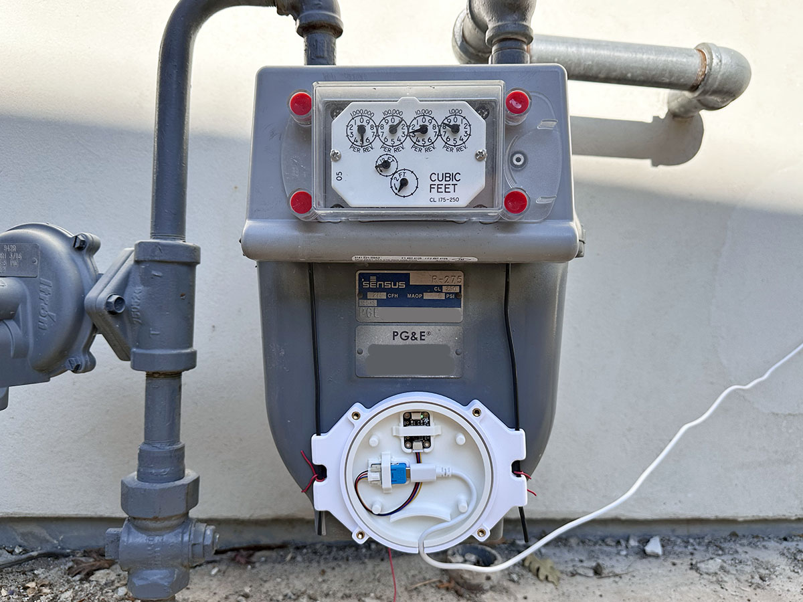
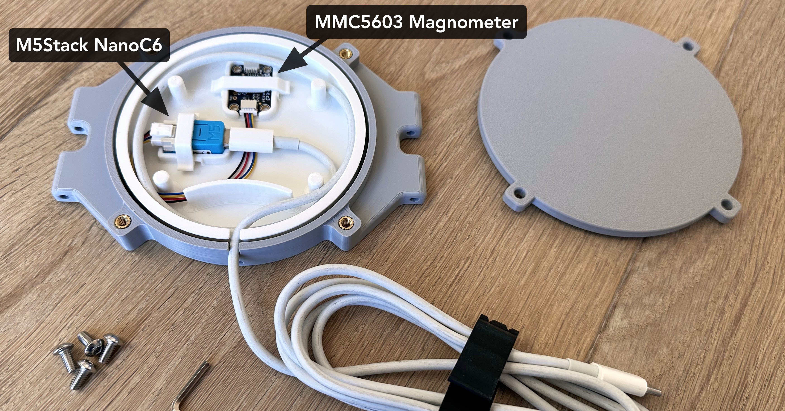

# ESPHome Gas and Water Meter 

This [ESPHome](https://esphome.io) project reads a gas or water meter using a magnetometer.
With this you can see your gas or water usage in Home Assistant in real time, track history,
build automations and data visualizations etc.

## Why another project?

This project is heavily based on the ideas and work from [the tronikos project](https://github.com/tronikos/esphome-magnetometer-water-gas-meter).
I started with that to read a gas meter, but I immediately ran into a showstopper:

- the tronikos project relies on an initial calibration step that expects magnetic field readings to never drift.
- but .. readings of my gas meter drift significantly with temperature changes.
- my meter bakes in the sun and breaks readings over the course of a day.

Other people had [reported similar issues](https://github.com/tronikos/esphome-magnetometer-water-gas-meter/discussions/40)
before [I did](https://github.com/tronikos/esphome-magnetometer-water-gas-meter/discussions/85).
This project is my attempt to fix this problem.

The tronikos project was generalized to work with both gas and water meters with small
configuration changes.  I kept that generalization, although since my use case was
to read a gas meter, **this project is mostly focused on reading gas meters**.

In addition to fixing the drift issue, I made other improvements and I provide a complete
solution for reading gas meters, including:
- all parts to buy
- a weather resistant 3D printed case with a durable mounting solution

## How does this meter reading tech work?

Water and gas meters contain internally moving components that can be read
with a magnetometer:
- **Water meters** typically contain an internal magnet that wobbles when water is
  flowing. These are usually fast moving.
- **Gas meters** typically contain internal diaphragms which move back and forth
  and drive a shaft, containing a gear with a magnet. These are usually slow moving.

The tronikos project has [an excellent write up with links to YouTube videos](https://github.com/tronikos/esphome-magnetometer-water-gas-meter?tab=readme-ov-file#compatibility).

Note: Smart phones contain magnetometers, and you read your meter [with this app](https://www.youtube.com/watch?v=ARZA6pmdD8Q).

# Gas Meter Reading - a complete solution

This section documents what I did to read a Californian PG&E gas meter reader.
It includes:
- exact parts needed
- a working configuration
- a 3D printed weather resistant case, with
- a durable mounting solution

There are other options described later.

### Design Notes

I chose to combine the esp32 and sensor into one physical package and run a USB-C power
cable to the meter rather than a [data cable](https://github.com/tronikos/esphome-magnetometer-water-gas-meter?tab=readme-ov-file#wiring).  This means:

- Your gas meter needs to be in wifi range.
- You need to run a usb-c cable between the gas meter and a USB power source.

The benefits:
- There are no electrical noise issues .. you can run a power cable as long as you like.
- There is only one enclosure/case needed
- No soldering is required.
  

## Parts
- [M5Stack NanoC6](https://shop.m5stack.com/products/m5stack-nanoc6-dev-kit): a 2 core ESP32 with wifi 6.  It's tiny and fits inside the case.
- [Adafruit MMC5603](https://www.adafruit.com/product/5579).  I saw **many** Amazon comments on magnetometers with incompatibility issues, getting a different part than what was ordered etc.  I believe the MMC5603 is the most sensitive of the options and Adafruit is a trusted supplier.
- [Adafruit Grove to STEMMA QT Cable](https://www.adafruit.com/product/4528).  This makes it solderless.
- USB power source, and a USB-C Power cable long enough to read your meter
- 3D printing capabilities, PETG filament, and M4 threaded inserts and nuts
- Wire for mounting (see below)

### Case

I designed a weather resistant case.  It is available on:
- Printables: https://www.printables.com/model/1517158-esphome-gas-meter-reader-case
- MakerWorld: https://makerworld.com/en/models/2121741-esphome-gas-meter-reader-case#

### THIS DOCUMENT IS NOT COMPLETE ... MORE TO COME SHORTLY