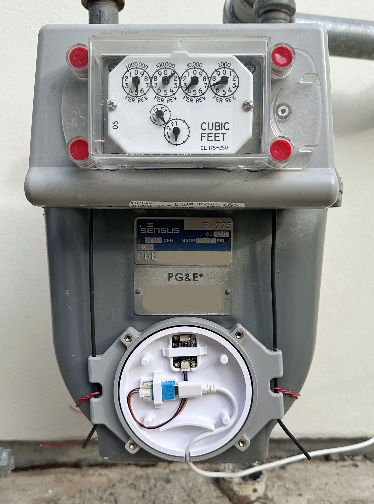

# ESPHome Gas and Water Meter

This [ESPHome](https://esphome.io) project reads a gas or water meter using a magnetometer.

This allow you to see your gas or water usage in Home Assistant in real time, track history,
build automations and data visualizations etc.

This project also provides a complete solution to read PG&E gas meters (California),
and will likely work with other gas meters, including:
- exact parts needed
- a working configuration
- a 3D printed weather resistant case with a durable mounting solution

### Acknowledgements

This project is heavily based on the ideas and work from the
[tronikos project](https://github.com/tronikos/esphome-magnetometer-water-gas-meter).

### Why another project?

The [tronikos project](https://github.com/tronikos/esphome-magnetometer-water-gas-meter)
does not work for everyone:

- it relies on an initial calibration step and expects magnetic field readings to never drift.
- but readings can drift significantly with temperature changes

My meter bakes in the sun which breaks measurements.
Other people had [reported similar issues](https://github.com/tronikos/esphome-magnetometer-water-gas-meter/discussions/40)
before [I did](https://github.com/tronikos/esphome-magnetometer-water-gas-meter/discussions/85).
This project is my attempt to fix this problem.

The tronikos project was generalized to work for both gas and water meters with small
configuration changes.  I kept that generalization, although since my use case was
to read a gas meter, **this project is mostly focused on reading gas meters**.

In addition to fixing the drift issue, I made other improvements.

## How does this meter reading tech work?

Water and gas meters contain internally moving components that can be read
with a magnetometer:
- **Water meters** typically contain an internal magnet that wobbles when water is
  flowing. These are usually fast moving.
- **Gas meters** typically contain internal diaphragms which move back and forth
  and drive a shaft, containing a gear with a magnet. These are usually slow moving.

The tronikos project also has [an excellent write up with links to YouTube videos](https://github.com/tronikos/esphome-magnetometer-water-gas-meter?tab=readme-ov-file#compatibility).

Note: Smart phones contain magnetometers, and you can read your meter [with this app](https://www.youtube.com/watch?v=ARZA6pmdD8Q).

# Steps

## 1. Hardware

This project requires 2 main components:
- a microcontroller.  Preferably a dual-core ESP32.
- a magnetometer.  Choices:
  - **MMC5603** - high resolution, low noise, fast sampling, stable output.
  - **QMC5883L** - a replacement for HMC5883L.
  - **QMC5883P** - similar to QMC5883L but better stability and lower noise.
  - **HMC5883L** - genuine chips are rare.  many boards claim to be this but are actually QMC5883L.

and a way to connect them.

### If you are choosing you own:

Read the [troknikos hardware section](https://github.com/tronikos/esphome-magnetometer-water-gas-meter#hardware-installation).
It is very good.

### What I chose:
I went a different path than troknikos.  I chose to combine the esp32 and sensor into
one physical package and run a USB-C power cable to the meter rather than a
[data cable](https://github.com/tronikos/esphome-magnetometer-water-gas-meter?tab=readme-ov-file#wiring).
This means your gas meter needs to be within wifi range.

I didn't want compatibility problems and preferred not to solder.  This is what
I chose:

- [M5Stack NanoC6](https://shop.m5stack.com/products/m5stack-nanoc6-dev-kit): a dual
  core ESP32 with wifi 6.  It's tiny, has a USB-C + grove connector.
- [Adafruit MMC5603](https://www.adafruit.com/product/5579).  I saw many Amazon comments on
 magnetometers with incompatibility issues.  I believe the MMC5603 is the most
 sensitive of the options and Adafruit is a trusted supplier.
- [Adafruit Grove to STEMMA QT Cable](https://www.adafruit.com/product/4528).  This makes it solderless.

The 3 parts connect.  Add a USB-C cable for power and initial flashing and
you are done:

## 2. Install ESPHome

This document assumes you are familiar with [Home Assistant](https://www.home-assistant.io/)
and somewhat familiar [ESPHome](https://esphome.io/).

There are two main ways to run ESPHome:
- the [Command-line Interface](https://esphome.io/guides/installing_esphome/):
  - you edit a yaml file on your computer
  - and run `esphome run <yaml_file>`
- the [ESPHome Device Builder AddOn](https://esphome.io/guides/getting_started_hassio/#installing-esphome-device-builder).
  - runs inside Home Assistant (web UI).
  - you use an in-browser editor to paste and edit YAML.

Either way, all you need to do is write some YAML and ESPHome builds custom
firmware and flashes the ESP32.  The first time you do this, you need to connect
the ESP32 to your computer via a USB cable.  After that, you can reflash the
firmware over wifi.

## 3. Build and Flash the firmware

### Case

I designed a weather resistant case.  It is available on:
- Printables: https://www.printables.com/model/1517158-esphome-gas-meter-reader-case
- MakerWorld: https://makerworld.com/en/models/2121741-esphome-gas-meter-reader-case#

### THIS DOCUMENT IS NOT COMPLETE ... MORE TO COME SHORTLY